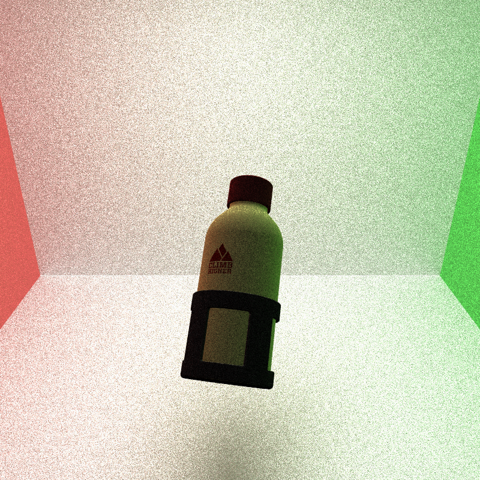
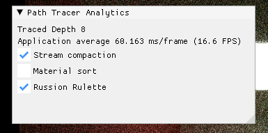
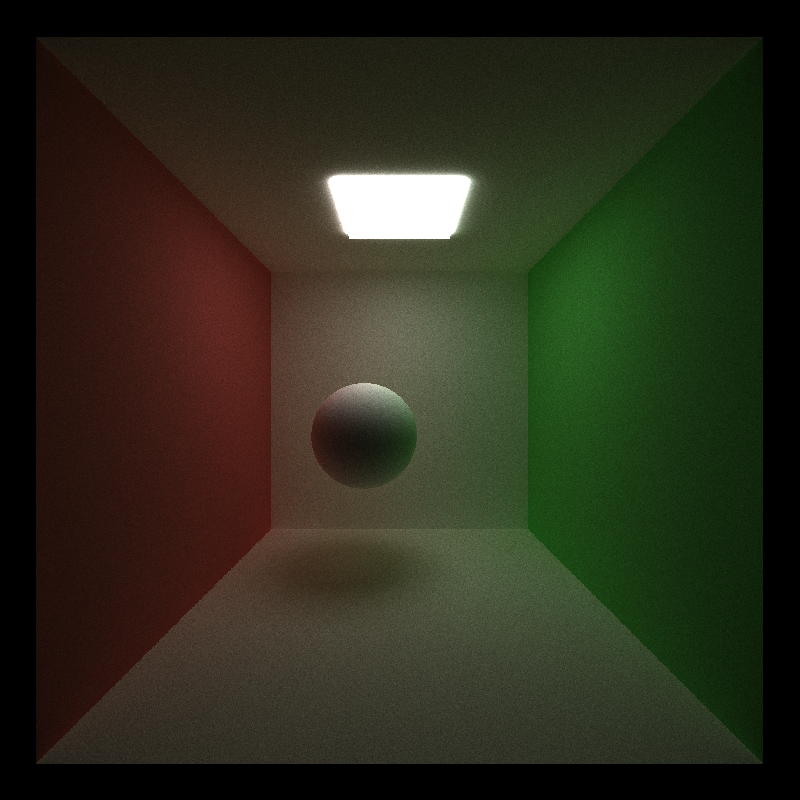
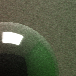
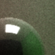
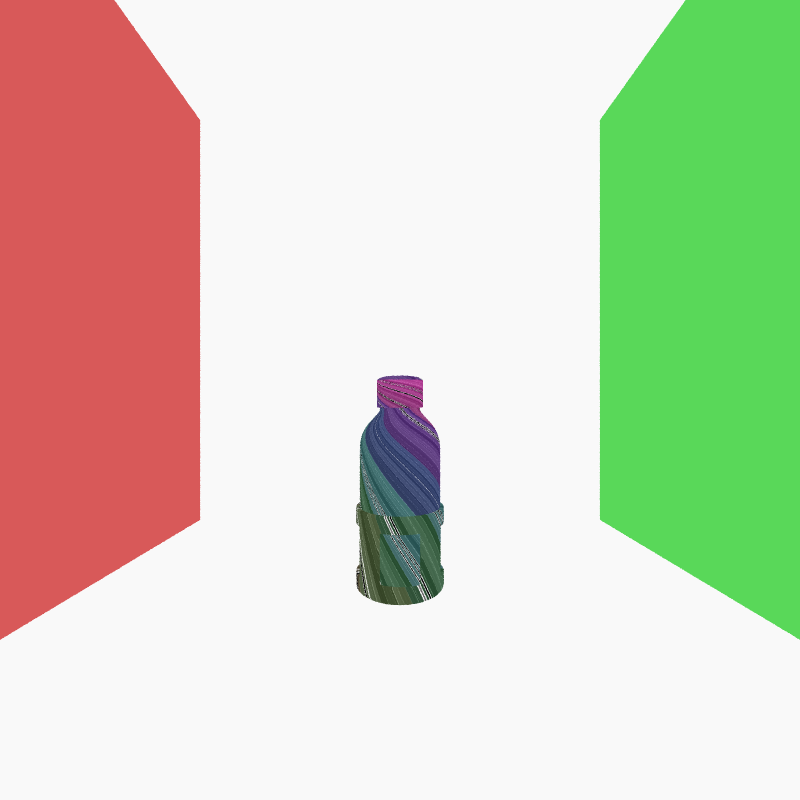
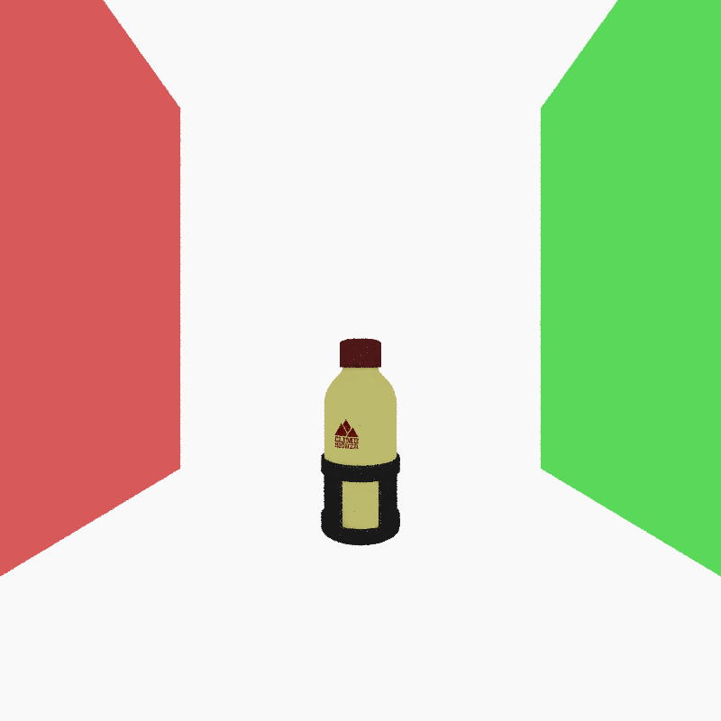
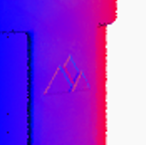
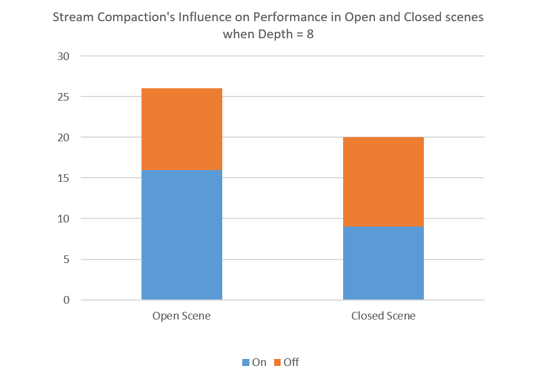

CUDA Path Tracer
================

**University of Pennsylvania, CIS 565: GPU Programming and Architecture, Project 3**

* Joanne Li
* Tested on: Windows 11, AMD Ryzen 5 5600H @ 3.30 GHz 16.0GB, NVIDIA GeForce RTX 3050 Laptop GPU 4GB

## Overview


The project implements a **CUDA-based path tracer** supporting both and perfect specular BRDFs. It uses **stream compaction** to efficiently remove terminated rays. **Ray sorting** by material is applied to keep rays hitting the same material stored contiguously in memory. The renderer also supports loading arbitrary **glTF meshes** and applying **texture mapping**, including base color and bump mapping.

### Run
The renderer supports loading **multiple scene files** in any supported format, including `.json` and `.gltf`. File paths are provided as command-line arguments. For example, do:
```
cis565_path_tracer scenes/bottle/WaterBottle.gltf scenes/walls.json
```
This command loads a bottle model (containing only the object's geometry) and a Cornell box scene that includes an emissive object and a camera. If you load only a single glTF model, you can uncomment a line in `scene.cpp` to use a default light and camera setup for quick testing:
```
else if (ext == ".gltf") {
    loadFromGLTF(filename);
    //initializeScene();  <--- uncomment!
    continue;
}
```
### GUI
The project uses `ImGui` to provide an interactive user interface. Users can toggle various features on and off using checkboxes to observe their impact on rendering performance in real time.



## Features
### Diffuse and Perfect Specular BRDF
|   |  |  | 
|:--:|:--:|:--:|
| *roughness=1* | *roughness=0.5* | *roughness=0* |

- The path tracer renders ideal diffuse surface using **Lambertian model**. The ray is sampled in a hemisphere. It use **cosine importance sampling** to sample directions that matches the shape of the Lambertian model.
- The path tracer renders specular surface using **perfect mirror reflection**. This BRDF samples directions by simply taking the reflecting direction of the view direction along the surface normal.
- It mixes diffuse and specular BRDF based on roughness.

### Stream Compaction
This path tracer applies stream compaction after the shading kernel to remove dead rays and terminate their corresponding threads.

After the shading kernel, some rays are no longer active, by hitting the sky, a light source, being terminated by Russian roulette, etc. They don't contribute to the final image, but their threads are still running. To avoid wasting computation, I use stream compaction to remove these dead rays from the array. This way, only the remaining active rays are processed in the next iteration.

### Material Sorting
The program reshuffles the rays to keep rays hitting the same mateirals continuous in memory. The sort call is between the intersection computing kernal and the shading kernal, so that the reshuffled rays can be sent to the shading stage.

### Anti-anliasing
The program implements stochastic sampled antialiasing by jittering the ray shooting a random position in a pixel.




*Left: before antialiasing* | *Right: after antialiasing*

### Russian Roulette
Russian roulette is implemented in the shading kernel after sampling the outgoing direction. It probabilistically terminates rays to reduce unnecessary computation. For rays that survive, their contribution is scaled by the inverse of the survival probability to maintain an unbiased result.

### Arbitrary glTF Mesh Loading
The renderer supports loading arbitrary glTF models using the `tinygltf` library. Complex meshes with multiple nodes, materials, and textures can be imported directly into the scene. Each node's transformation hierarchy is properly handled, and associated materials and textures are automatically attached to their corresponding primitives.

### Texture Mapping
|   |  |  | 
|:--:|:--:|:--:|
| *Using a grid texture to test texture mapping*    | *Base color* | *Bumping normals* |

- **Structure:**

    The model data is stored in three main structures: `Geom`, `Material`, and `Texture`. Each geometry stores a `materialId`, which links to a material that contains a `textureId`, and use that to find the specific texture. 

    The advantage of this structure is that it avoids redundant memory usage. When a texture is referenced by multiple materials, it is stored only once. In contrast, if each material stored its own copy of the texture data, a texture could be stored multiple times.

- **Data Storage & Passing:**

    Pixel data is initially encoded in `uint8`, so it is converted to `float4` and stored in an array. Each texture is then bound as a **CUDA texture object**.

- **Multiple textures:** 

    To support multiple textures, a texture object container (`struct TexObjContainter`) is created to store texture handles, and an array of these containers is allocated and transferred to the GPU. 

- **BaseColor mapping:**

    During rendering, the shader simply calls CUDA's texture sampling function to sample texture colors. Use the color given by the base color texture directly as the material color.

- **Bump mapping:**

    For bump mapping, the normal map is sampled in tangent space, transformed into world space using the surface's `tangent`, `bitangent`, and `normal`, and then added to the original surface normal.


## Performance Analysis
### Stream Compaction


## Credits
ImGUI: https://github.com/ocornut/imgui  
tinygltf: https://github.com/syoyo/tinygltf  
